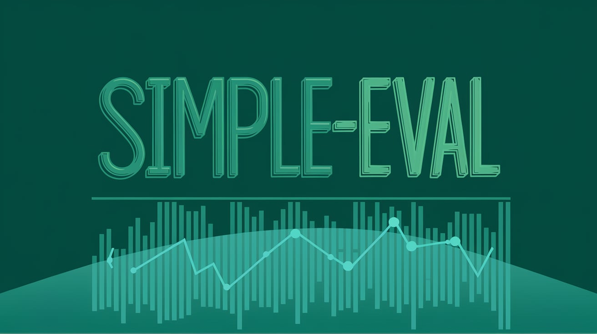

# Simple LLM Evaluation

Welcome to the simple llm evaluation framework, or SimplEval for short.

## Getting Started

See the [📚 Quickstart Guide 📚](https://pages.github.com/cyberark/simple-llm-eval/getting-started/quickstart/)

## Documentation

See [📚 Project Documentation 📚](https://pages.github.com/cyberark/simple-llm-eval/)

## Contributing

Contributions are welcome!

If you would like to contribute to the SimplEval, please follow the guidelines outlined in the [CONTRIBUTING.md](https://github.com/cyberark/FuzzyAI/blob/main/CONTRIBUTING.md) file.

## License

SimplEval is released under the [Apache License](https://www.apache.org/licenses/LICENSE-2.0). See the [LICENSE](https://github.com/cyberark/simple-llm-eval/blob/main/LICENSE) file for more details.

## Contact

If you have any questions or suggestions, feel free to join our [GitHub discussions forum](https://github.com/cyberark/simple-llm-eval/discussions) 💬

If you want to report a bug or request a feature, please open an issue in the [GitHub issues tracker](https://github.com/cyberark/simple-llm-eval/issues) 🐛
