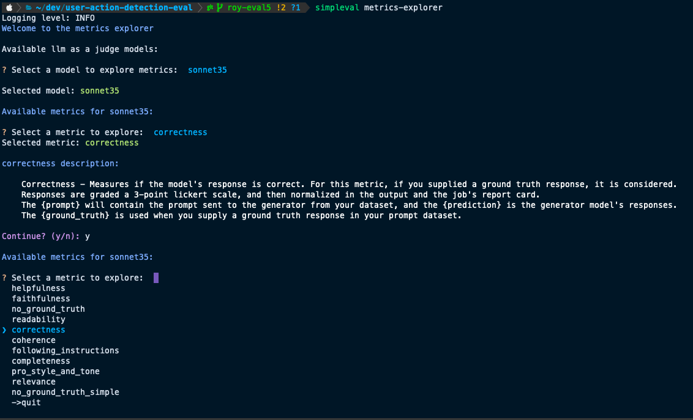

# High-Level Concepts 🎓 

## **Evaluation Sets**

> An <span style="color:green">**"evaluation set"**</span> or an <span style="color:green">**"eval set"**</span> is your use case.

It is the use case that you want to test your LLM against.

For example:

* Detecting user actions in a screenshot using a vllm
* Answering questions about a product

### Eval-set Dir Structure
The eval set is a folder which name is the eval-set name. 

It includes:

* `ground_truth.jsonl`: jsonl file with the list of tests and their expected results and optionally any additional data (payload) required for the task to run. The payload is the input for the task to run with.
* `config.json` file: json config file for your eval-set, see the [config section](../users/configuration.md).
* a `testcases` folder that contains one or more <span style="color:green">**"testcase"**</span> folders - more on that below.

Here is an example of the directory structure for an eval set:

## **Testcases**
> A <span style="color:green">**"testcase"**</span> is the set of prompt, parameters and code that affect the llm results.
 
For example, a testcase could be using sonnet3.5 model with a specific prompt to evaluate your LLM, versus using gpt-o1 with its own prompt, or using sonnet3.5 with a different prompt. 
It could also be different model parameters like temperature, top_k, top_p, or anything else that can affect the llm results.


In this case you would probably name your testcases accordingly:

* `sonnet35-prompt1`
* `sonnet35-prompt2`
* `gpt-o1-prompt1`

### LLM Tasks
An <span style="color:green">**"llm task"**</span> is the task that you run under this testcase. It is the logic that's called in your `task_handler.py` implementation. In case you already have the results, you can simply return them in `task_handler.py`.

### Testcase Dir Structure
A testcase is a folder that includes:

* `task_handler.py` - the implementation of the task runner. See the [Implementing Handlers section](init.md#implement-the-llm-task-logic).
* `llm_task_results.jsonl` - Results for your llm tasks run - generated after you run at least once.
* `llm_task_errors.txt`, `eval_errors.txt` - errors from your llm and eval runs in case there are any. Use for troubleshooting.


## **Eval-set Dir Structure Example**

Consider an eval-set named **user-actions-by-events**, with the testcases mentioned above.
Here is the expected directory structure:

```
user-actions-by-events/
├── ground_truth.jsonl
├── config.json
└── testcases/
  ├── sonnet35-prompt1/
  │   ├── task_handler.py
  │   └── ...
  └── ...
  ├── sonnet35-prompt2/
  │   ├── task_handler.py
  │   └── ...
  └── ...
  ├── gpt-o1-prompt1/
  │   ├── task_handler.py
  │   └── ...
  └── ...
```


## **LLM as a Judge**
This is a technique to evaluate LLMs by using LLM models as judges.
They include metrics for which you want to evaluate your LLMs against.

### LLM as a Judge Model
The built-in llm as a judge is implemented using Claude Sonnet 3.5. To see available models, run:

```bash
simpleval list-models
```


### LLM as a Judge Metrics
We support different LLM as a Judge metrics, such as `correctness`, `relevance` and more.
Not all metrics are useful in all cases. To learn more about the available metrics, use the metrics explorer command:

```bash
simpleval metrics-explorer
```


