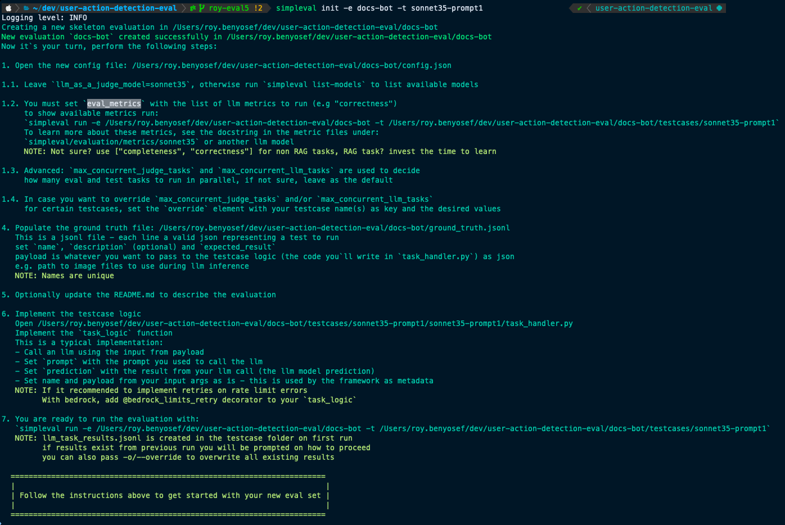

# Init a New Evaluation Set 🎬 

You have two ways to create a new evaluation set:

## Option 1: Interactive Mode (Recommended ⭐️)

This option will walk you through each configuration step interactively.

Run the init command and follow the on-screen instructions:

```bash
simpleval init
```

!!! info
    * When you select the judge, `simpleval` will test for working credentials, and if not available will show the required variables. You can continue the init process and set the variables later.
    * You can configure how many judge tasks or llm tasks (your logic that you test for) to run concurrently. The default is 10 for both.


## Option 2: Init From Template

This will create a new eval set directory from a template using default values.
<br>
You will need to update the configuration according to the on screen instructions.

Run the init command:

```bash
simpleval init-from-template --eval-dir <eval-dir-name> --testcase <testcase-name>
```

For example:

```bash
simpleval init --eval-dir user-actions-by-events --testcase sonnet35-prompt1
```

And follow the on-screen instructions.

The basic and mandatory steps are:

## Updating the metrics in `config.json`

Run `simpleval metrics-explorer` to see the available metrics and select the ones that fit your use-case.
For more information see the [config section](../users/configuration.md).

## Populate `ground_truth.jsonl`

This is a JSONL file with the list of tests to run; each line is a valid JSON object.
An example `ground_truth.jsonl` file:

```json
{ "name": "test1", "description": "description 1", "expected_result": "result1", "payload": { "param1": "value1", "param2": "value2" } }
{ "name": "test2", "description": "description 2", "expected_result": "result2", "payload": { "param1": "value1", "param2": "value2" } }
```

## Implement the LLM Task Logic

✅ In your `<your eval set>/datasets/<your dataset name>/task_handler.py` file, implement your logic.

`task_logic(name: str, payload: dict)`

✅ Call your llm using your prompts, and the payload from the ground truth file.

✅ You must return a `simpleval.testcases.schemas.llm_task_result.LlmTaskResult` object.


```python
result = LlmTaskResult(
    name=name,
    prompt=your_prompt_for_the_llm,
    prediction=llm_response,
    payload=payload,
)
```

  * `name`, `payload` - send the name, payload task_logic in params as is
  * `prompt` - the prompt that you sent to the llm
  * `prediction` - the response from the llm call

!!! tip "Retry Decorator"
    It is recommended to implement a retry decorator for your function to handle transient errors such as rate limit errors.
    <br>
    If you are using Bedrock or LiteLLM, use **@bedrock_limits_retry** or **@litellm_limits_retry**
    <br>
    Otherwise implement your own.

To debug your code, see the [Debugging Handlers section](../users/debugging-handlers.md)

!!! warning "Breaking Changes"
    **IMPORTANT:** Breaking changes in simpleval might break your plugin. If you get a "PLUGIN ERROR", check the error message. Usually it is import issues, or changes to LlmTaskResult.

## On-Screen Instructions

After running the init command you'll have everything you need to know on screen:



You are now ready to run your first evaluation!
