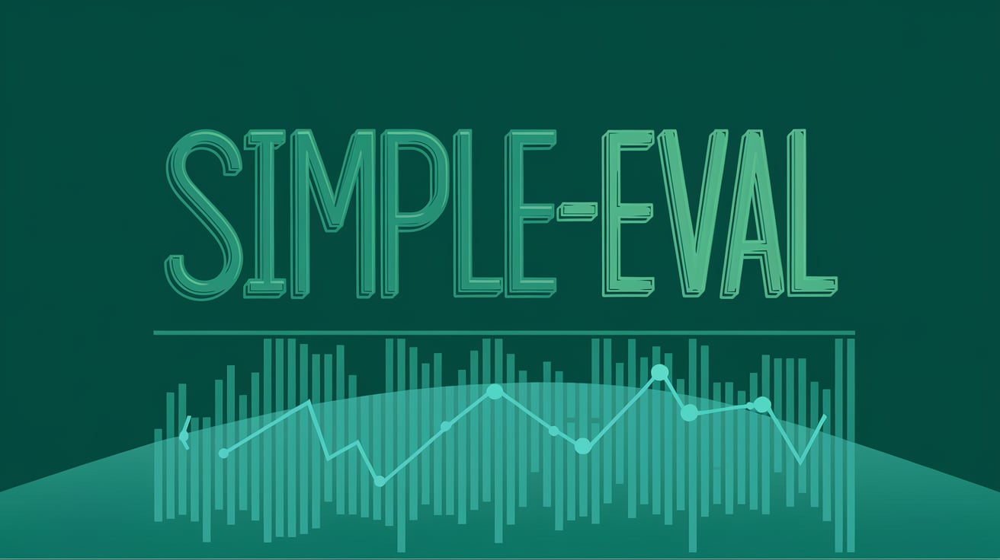

# **Simple-Eval**

{: style="height:1000%;width:50%;float:right;margin-left:20px"}

Welcome to the simple LLM evaluation framework.

You can use simpleval to evaluate your LLMs with a simple and easy-to-use CLI.

  
**🚀 Head over to [Quickstart](./getting-started/quickstart.md) to get started.**
 
 
 
 

---

### What's In The Box? 🎁
The built-in evaluation is using the "LLM As a Judge" technique, based on the [AWS Bedrock LLM As a Judge](https://docs.aws.amazon.com/bedrock/latest/userguide/model-evaluation-type-judge-prompt.html) implemented with various LLM providers.

### Why Simple-Eval?
It is dead simple and easily customizable.

Often using an evaluation platform is an overkill, and other frameworks did not match the simple requirements we had.
And so, simpleval was born.

### Further Reading 📚

If you want to deep dive into the "LLM As a Judge" evaluation technique, some relevant papers are:

* [LLMs-as-Judges: A Comprehensive Survey on LLM-based
Evaluation Methods](https://arxiv.org/pdf/2412.05579)

* [A Survey on LLM-as-a-Judge](https://arxiv.org/pdf/2411.15594)

Happy reading!
