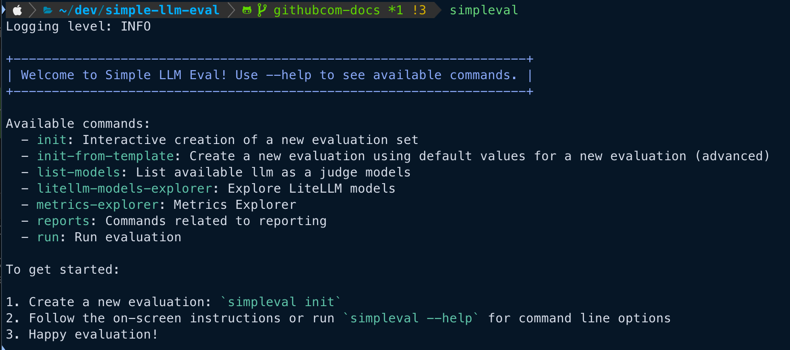

# CLI Commands 🖥️

Learn all the options with the help command:

```bash
simpleval -h
```

List available commands:

```bash
simpleval
```
<br>



## Important flags

### Verbosity
All commands support the `--verbose` or `-v` flag to get more detailed output.
<br>This will also make the error files more detailed.


### Overwrite results

Use `--overwrite` or `-o` with care to overwrite the results of the evaluation.
This will delete all existing results and re-run the evaluation.

!!! warning
    Do not use this if you only want to attempt failed tests.

### Report Console Output
All report commands (`run`, `reports eval`, `compare`, and their file counterparts) create an HTML report by default (React-based `html2` by default).

If you want console output, you can also pass the `--report-format console` or `-r console` flag.
